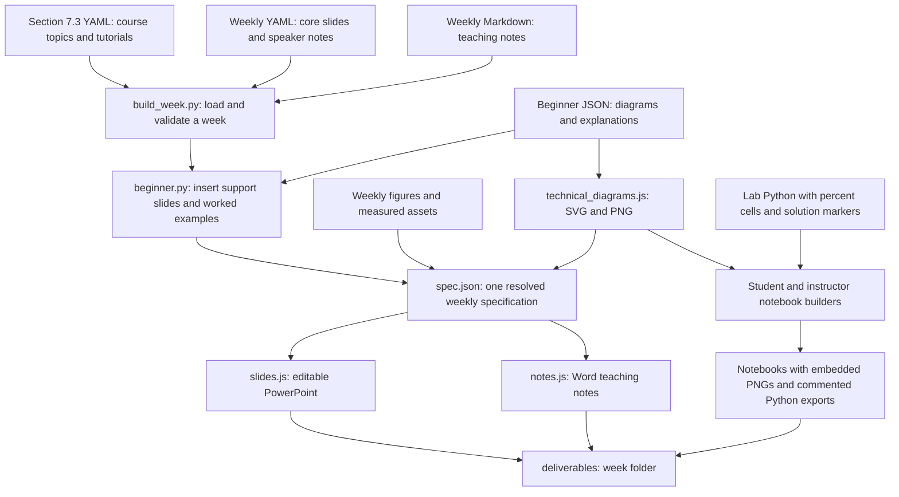

# Teaching pack codebase guide

The active project generates a twelve-week Generative AI course through a source-to-deliverable build pipeline. Edit curriculum sources, then regenerate the files in `deliverables/`. The `legacy/` folder contains an earlier independent generator and is retained for reference.

## End to end build flow



## Source map

| Path | Responsibility | Edit when |
|---|---|---|
| `curriculum/section_7_3.yaml` | Course scope, week order, lecture topics and tutorials | The authorised descriptor content changes |
| `curriculum/weeks/week_XX.yaml` | Forty core slides, speaker notes and coverage terms | Lecture content changes |
| `curriculum/beginner/week_XX.json` | Prerequisites, three technical diagrams, example traces, glossary and code symbols | A concept needs clearer explanation |
| `curriculum/notes/week_XX.md` | Full teaching notes, exercises, answers and references | Detailed lecture or lab guidance changes |
| `curriculum/labs/week_XX_lab.py` | Student exercises and instructor solutions in one percent-format source | Code or code-reading guidance changes |
| `curriculum/figures/week_XX.py` | Existing conceptual figures and result visualisation | An existing figure changes |
| `curriculum/assets/` | Measured lab outputs and asset-generation scripts | New lab measurements are produced |
| `curriculum/course/` | Course-level guide and rationale sources | Course guidance changes |
| `tools/build_week.py` | Resolves content, validates it and coordinates all weekly outputs | The output pipeline changes |
| `tools/beginner.py` | Validates beginner content, inserts four support slides, remaps slide references, embeds images and exports Python | The shared teaching structure changes |
| `tools/technical_diagrams.js` | Renders the same diagram labels as native PowerPoint objects, SVG and PNG | Diagram layout changes |
| `tools/slides.js`, `tools/notes.js` | PowerPoint and Word layout engines | Office layout changes |
| `tools/build_course.py`, `tools/build_descriptor.py` | Course guide, rationale and descriptor builders | Course-level output generation changes |
| `tools/render.py`, `tools/render_office.ps1` | Microsoft Office PDF and PNG previews | Visual review is needed |
| `tools/verify_beginner.py` | Portable image, code, notebook and slide structure checks | Verify a rebuilt release |
| `tools/test_labs.py` | Executes solution notebooks with small smoke settings or full settings | Executable lab logic changes |
| `build/` | Rebuildable caches, specifications and review previews | Inspect a failed build |
| `deliverables/` | Files distributed to instructors and students | Use the generated pack |

## Beginner diagram contract

Each week defines `overview`, `mechanism` and `lab` diagrams with four to six numbered blocks. Each block names an operation, explains it in plain language and can name a real lab symbol. `arrows` contains one label for each connection. An optional feedback route names the operation to repeat and `feedback_to` gives its zero-based target. `insert_before_title` anchors a mechanism diagram beside an exact existing slide title.

The overview and lab PNGs attach directly to notebook Markdown cells. The Word notes use the same PNGs. The PowerPoint uses editable blocks, labels and connectors. Separate SVG and PNG files appear in each week's `Diagrams/` folder. A correction to an authored diagram therefore updates every format on the next build.

## Lab exercise boundaries

`### BEGIN SOLUTION` and `### END SOLUTION` enclose instructor code. `### STUB` supplies the student's starter code. Markdown answer blocks use `<!-- BEGIN ANSWER -->` and `<!-- END ANSWER -->`. Cells tagged `solution-only` are omitted from student notebooks. Preserve these markers when explaining or editing code.

The generated Python files translate `%pip` installation cells into ordinary Python subprocess calls. They are syntactically valid Python and keep the same student TODOs or instructor solutions as their corresponding notebook. Run completed code in order with the listed dependencies. Model downloads and training still require the relevant network access and compute resources.

## Build and check

```powershell
.venv/Scripts/python.exe tools/build_week.py --weeks 1-12
.venv/Scripts/python.exe tools/build_course.py
.venv/Scripts/python.exe tools/verify_beginner.py
.venv/Scripts/python.exe tools/test_lab_helpers.py
node tools/test_teaching_notes.js
.venv/Scripts/python.exe tools/audit_inline_math.py
.venv/Scripts/python.exe tools/audit_coverage.py
.venv/Scripts/python.exe tools/render.py --weeks 1-12
```

Use `--weeks 12` for an individual week, or `--labs-only` to rebuild notebook and Python exports after a lab-only edit. After changing executable lab logic, execute the affected solution notebook with `tools/test_labs.py`. Rendering requires the local Microsoft Office installation and Poppler used by this repository.
