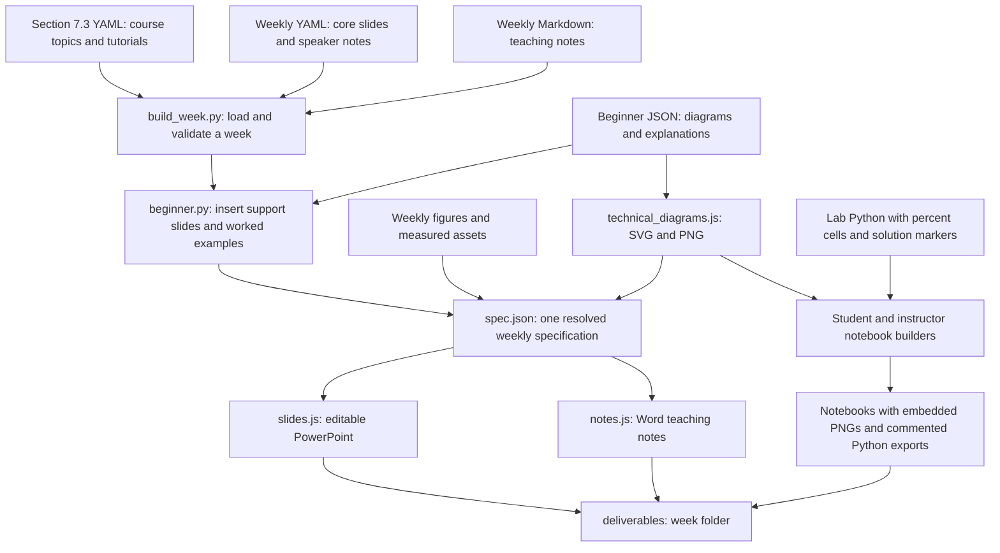

# Teaching pack codebase guide

The active project generates a twelve-week Generative AI course through a source-to-deliverable build pipeline. Edit curriculum sources, then regenerate the files in `deliverables/`. The `legacy/` folder contains an earlier independent generator and is retained for reference.

## End to end build flow



## Source map

| Path | Responsibility | Edit when |
|---|---|---|
| `curriculum/section_7_3.yaml` | Course scope, week order, lecture topics and tutorials | The authorised descriptor content changes |
| `curriculum/weeks/week_XX.yaml` | Forty core slides, speaker notes and coverage terms | Lecture content changes |
| `curriculum/beginner/week_XX.json` | Prerequisites, five technical diagrams, recap cards, example traces, glossary and code symbols | A concept needs clearer explanation |
| `curriculum/glossary.json` | Canonical terms reused across all weeks and the course glossary | A definition needs correction |
| `curriculum/notes/week_XX.md` | Full teaching notes, exercises, answers and references | Detailed lecture or lab guidance changes |
| `curriculum/labs/week_XX_lab.py` | Student exercises and instructor solutions in one percent-format source | Code or code-reading guidance changes |
| `curriculum/figures/week_XX.py` | Existing conceptual figures and result visualisation | An existing figure changes |
| `curriculum/assets/` | Measured lab outputs and asset-generation scripts | New lab measurements are produced |
| `curriculum/course/` | Course-level guide and rationale sources | Course guidance changes |
| `tools/build_week.py` | Resolves content, validates it and coordinates all weekly outputs | The output pipeline changes |
| `tools/beginner.py` | Validates beginner content, inserts vocabulary and diagram slides, adds worked examples and remaps slide references | The shared teaching structure changes |
| `tools/technical_diagrams.js` | Renders the same diagram labels as native PowerPoint objects, SVG and PNG | Diagram layout changes |
| `tools/teaching_support.js`, `tools/arial_widths.json` | Shared course-map and recap scenes, with measured Arial wrapping | Course support layout changes |
| `tools/slides.js`, `tools/notes.js` | PowerPoint and Word layout engines | Office layout changes |
| `tools/build_course.py`, `tools/build_descriptor.py` | Course guide, rationale and descriptor builders | Course-level output generation changes |
| `tools/render.py`, `tools/render_office.ps1` | Microsoft Office PDF and PNG previews | Visual review is needed |
| `tools/verify_beginner.py` | Portable image, code, notebook and slide structure checks | Verify a rebuilt release |
| `tools/test_labs.py` | Executes solution notebooks with small smoke settings or full settings | Executable lab logic changes |
| `build/` | Rebuildable caches, specifications and review previews | Inspect a failed build |
| `deliverables/` | Files distributed to instructors and students | Use the generated pack |

## Beginner diagram contract

Each week defines `overview`, `mechanism`, `training`, `inference` and `lab` diagrams with four to seven numbered blocks. The `training` and `inference` IDs also cover preparing and using systems such as prompt tests, deployment and RAG. Each block names an operation, explains it in plain language and can name a real lab symbol. `arrows` contains one output label for each connection. An optional feedback route names the operation to repeat and `feedback_from` and `feedback_to` give its zero-based source and target. `insert_before_title` anchors each detailed diagram beside an exact existing slide title. IDs must be unique. The builder computes the final slide count from the authored diagrams.

All seven PNGs (five technical diagrams, course map and recap) attach directly to notebook Markdown cells. The Word notes use the same PNGs. The PowerPoint uses editable blocks, labels and connectors. Separate SVG and PNG files appear in each week's `Diagrams/` folder. SVG and PowerPoint share one geometry function, so every arrow starts and ends on a block boundary in both formats. A correction to an authored diagram therefore updates every format on the next build. Shared scenes use measured Arial word wrapping and explicit single-line boxes. Rounded-corner adjustments apply only to rounded rectangles; applying them to ellipses makes Office reject a deck.

The recap replaces the original summary and moves to the last slide, keeping 46 slides. The original detailed points remain in Word. Lecture-plan ranges include the relocated final recap. `recap` in each beginner JSON supplies four to six concept cards, an illustrative example, exit question/answer, next-class link and instructor script.

## Lab exercise boundaries

`### BEGIN SOLUTION` and `### END SOLUTION` enclose instructor code. `### STUB` supplies the student's starter code. Markdown answer blocks use `<!-- BEGIN ANSWER -->` and `<!-- END ANSWER -->`. Cells tagged `solution-only` are omitted from student notebooks. Preserve these markers when explaining or editing code.

The generated Python files translate `%pip` installation cells into ordinary Python subprocess calls. They are syntactically valid Python and keep the same student TODOs or instructor solutions as their corresponding notebook. Run completed code in order with the listed dependencies. Model downloads and training still require the relevant network access and compute resources.

## Measured results

Numbers from real runs never go straight into slide or note text. They flow through one path:

1. A run writes a JSON file in `curriculum/assets/week_XX/`. Asset scripts `make_week_02.py` to `make_week_06.py` and `make_week_06_reasoning.py` write `metrics.json`; `make_week_05_bert.py` and `make_week_05_gpt2.py` write the measured attention tables `bert_attention.json` and `gpt2_attention.json`. A full lab run with `GENAI_RESULTS_PATH` set writes `results.json` (weeks 1, 5 and 7–12).
2. `tools/fill_results.py --weeks N` turns those files into the sentences, tables and numbers in `fill.json`.
3. Slides and notes contain `{{PLACEHOLDER}}` names; `build_week.py` substitutes them and refuses to build while one is unfilled.

Replace a stored file only with a complete run of the current notebook, after comparing it with the stored one, and record the run in `research/lab_runs_2026-10.json` if a time is quoted anywhere. Smoke runs check that the code runs; they never feed `fill.json`.

## Text conventions

- Inline maths is written `$…$` in the notes and in slide text. The build converts it to Unicode with real sub- and superscripts and wraps it in `<var>…</var>`, which `notes.js` uses to set single-letter variables in italics and digits, operators and Greek letters upright. A `$` directly before a digit never closes maths, so prices such as "$0.10 input/$0.40 output" stay as text.
- In the Word notes, companion headings are `## Slide N: Title`, where N and Title are those of the 46-slide deck; `verify_beginner.py` fails on a mismatch.
- Bare `<tags>` in Markdown are dropped by Word and Jupyter; put them in `code`. Use →, −, ×, en dashes and "≈ 80%" (with a space); `audit_prose.py` checks these.
- Quiz slides store the correct option as `answer` (0–3), and the speaker notes say "Answer: X" (or "Answer X") with the same letter; `audit_prose.py` checks this and the spread of letters.

## Build and check

```powershell
.venv/Scripts/python.exe tools/build_week.py --weeks 1-12
.venv/Scripts/python.exe tools/build_course.py
.venv/Scripts/python.exe tools/verify_beginner.py
.venv/Scripts/python.exe tools/test_lab_helpers.py
.venv/Scripts/python.exe tools/test_lab_runtime.py
.venv/Scripts/python.exe tools/test_beginner_support.py
.venv/Scripts/python.exe tools/test_technical_figures.py
node tools/test_teaching_notes.js
node tools/test_technical_diagrams.js
.venv/Scripts/python.exe tools/audit_inline_math.py
.venv/Scripts/python.exe tools/audit_coverage.py
.venv/Scripts/python.exe tools/audit_slide_text.py
.venv/Scripts/python.exe tools/audit_prose.py
.venv/Scripts/python.exe tools/audit_flat_bullets.py
.venv/Scripts/python.exe tools/lint_figures.py --weeks 1-12
.venv/Scripts/python.exe tools/audit_figure_text.py --weeks 1-12
.venv/Scripts/python.exe tools/verify_pilot_artifacts.py
.venv/Scripts/python.exe tools/check_links.py
.venv-labs/Scripts/python.exe tools/test_labs.py --weeks 1-12
.venv/Scripts/python.exe tools/render.py --weeks 1-12
.venv/Scripts/python.exe tools/build_revision_review.py
```

Use `--weeks 12` for an individual week, or `--labs-only` to rebuild notebook and Python exports after a lab-only edit. After changing executable lab logic, execute the affected solution notebook with `tools/test_labs.py`. Rendering requires the local Microsoft Office installation and Poppler used by this repository.

The renderer also writes `slides.layout.json` with text boxes that exceed PowerPoint's measured text bounds. Review those boxes and the rendered images before distributing a rebuild. Structural checks confirm correct attachments and editable objects; visual review checks the actual page layout.

## Revision loop

The full routine, with the rules, commands and a table of mistakes to look for, is in [research/REVIEW_PROCESS.md](research/REVIEW_PROCESS.md). Edit slide YAML with `tools/yaml_edit.py` (`edit_slides`), which changes only the keys you name and checks that nothing else moved.

Revise one week from its sources, rebuild, run the lab smoke check, render with Office, and inspect every individual slide/page/diagram. Record a defect, explain the correction, then rebuild and inspect the affected output again. Keep source and image hashes in the visual manifests so old previews cannot certify a new build. Measured results stay separate from illustrative arithmetic and smoke outputs.
